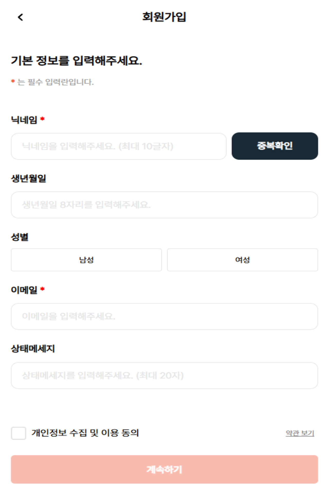
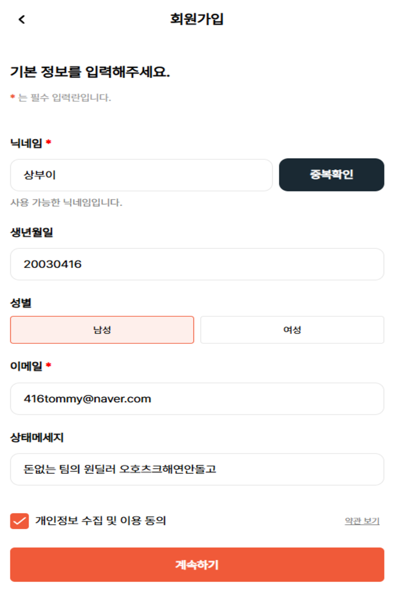
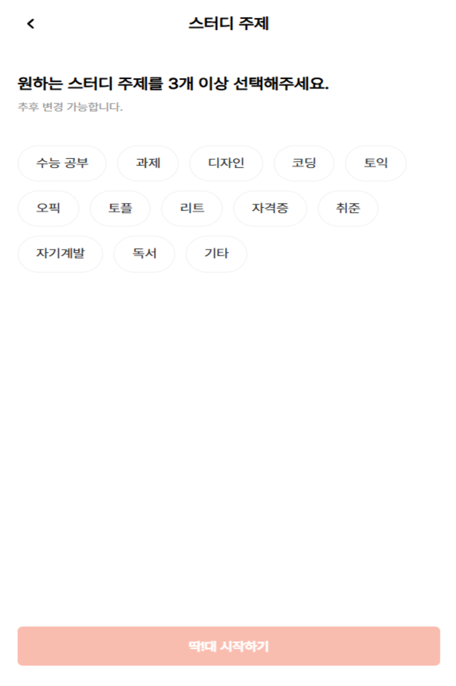
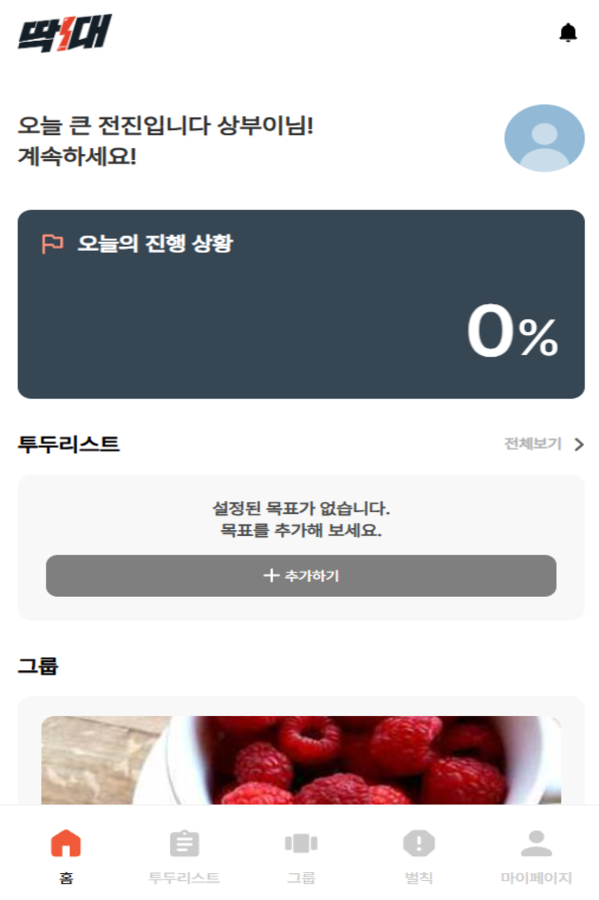
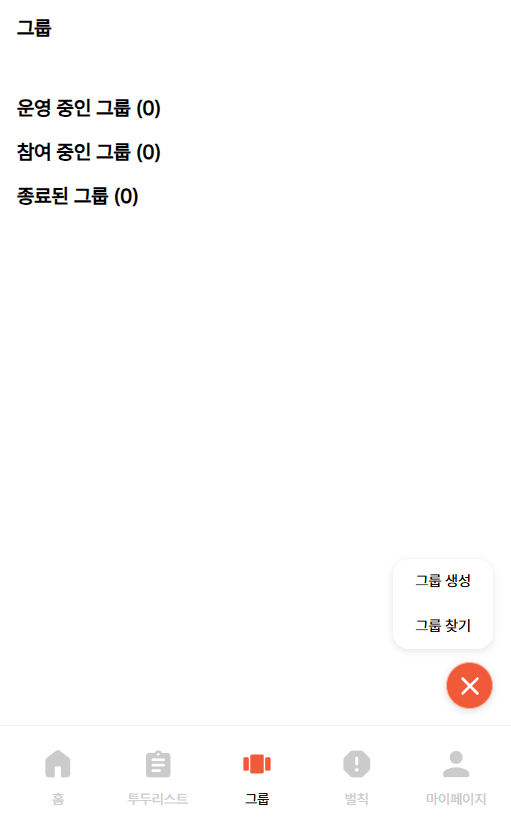

# DoitOrPay
벌칙을 정해 todo 리스트의 이행을 강제하게 되는 일정 관리 서비스
사용자는 개인과 그룹의 목표를 이행하고 인증하며, 기한 내 수행에 실패할경우 벌칙 수행을 인증합니다.

## Demo
실제 서비스 UI 일부를 캡처한 화면입니다.
### Core User Flow
- 회원가입 및 인증
- 그룹 참여
- 약속(Do) 및 벌금(Pay) 규칙 설정
- 그룹 피드에서 이행 상태 확인

    

  
  

  

  

  

  

  

  

## Backend Architechture

### High-Level Request Flow
1. Client → API 요청
2. OAuth 로그인 후, 서버 session에 사용자 정보 저장
3. 요청마다 세션을 통해 사용자 조회 및 인가 처리
4. 도메인 서비스 로직 실행
5. Neo4j 트랜잭션 처리
6. 상태 변경 결과 반환

## Architecture
Monorepo:
- `backend/` : API 서버, DB 연동, 인증
- `frontend/` : UI 및 사용자 플로우

> 백엔드 담당: 최상준
> - 로그인 / OAuth 연동  
> - Neo4j 기반 데이터 모델링  
> - 핵심 도메인 로직 설계 및 구현  
> - 인증/인가 및 API 구조 설계

## Tech Stack
### Backend
- Python, Flask
- DB: Neo4j
- Auth: 카카오톡, 네이버 인증 API

### Frontend
- React 기반 (팀원 담당)